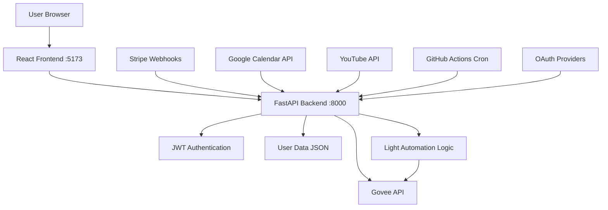

# 🚀 Deployment Guide - Gotham Lights Authentication System

## 🏠 **Running Locally (Development)**

### Quick Start
```bash
# Make sure you're in the project directory
cd "Curtain Lights"

# Run both servers
./start.sh
```

### Manual Start (Alternative)
```bash
# Terminal 1 - Backend
uvicorn app.main:app --reload --port 8000

# Terminal 2 - Frontend  
cd frontend
npm run dev
```

**Access URLs:**
- 🎨 Frontend: http://localhost:5173
- 📡 Backend API: http://localhost:8000
- 📚 API Documentation: http://localhost:8000/docs

---

## ☁️ **Production Deployment Options**

### Option 1: Fly.io (Recommended)

**Pros:**
- Always running (24/7)
- Automatic SSL certificates
- Global CDN
- Built-in monitoring

**Setup:**
1. Install Fly CLI: https://fly.io/docs/getting-started/installing-flyctl/
2. Create account: `fly auth signup`
3. Deploy: `fly deploy`

**Fix GitHub Workflow:**
1. Go to your GitHub repo → Settings → Secrets
2. Add secret: `FLY_APP_NAME` = your app name from `fly.toml`
3. The cron workflow will ping your app every minute to keep it alive

### Option 2: Home Server/Raspberry Pi

**Pros:**
- Full control
- No monthly costs
- Local network access

**Setup:**
```bash
# Install dependencies
sudo apt update
sudo apt install python3-pip nodejs npm

# Clone your repo
git clone [your-repo-url]
cd curtain-lights

# Install and run
pip3 install -r requirements.txt
cd frontend && npm install && npm run build && cd ..

# Run with PM2 (process manager)
npm install -g pm2
pm2 start "uvicorn app.main:app --host 0.0.0.0 --port 8000" --name curtain-lights
```

### Option 3: Railway/Heroku

**Pros:**
- Simple deployment
- Automatic scaling
- Built-in database options

**Setup:**
1. Connect GitHub repo to Railway/Heroku
2. Set environment variables
3. Deploy automatically on git push

---

## 🔄 **Do You Need It Always Running?**

### **YES, if you want:**
- ✅ Real-time Stripe payment notifications
- ✅ YouTube subscriber milestone triggers  
- ✅ Google Calendar event automations
- ✅ Web interface always accessible
- ✅ Webhook endpoints to receive events

### **NO, if you only want:**
- ❌ Manual light control only
- ❌ Scheduled triggers (use cron jobs instead)
- ❌ Local automation only

---

## 🔧 **Current System Architecture**



---

## 🛠 **Troubleshooting**

### **GitHub Workflow Errors**
The `FLY_APP_NAME` errors mean:
1. You haven't deployed to Fly.io yet, OR
2. You haven't set the GitHub secret

**Fix:**
- **Option A:** Deploy to Fly.io and set the secret
- **Option B:** Delete `.github/workflows/cron.yml` if not using Fly.io

### **Local Development Issues**
- **Port conflicts:** Change ports in `start.sh` if 8000/5173 are taken
- **Dependencies:** Run `pip install -r requirements.txt` and `npm install`
- **Environment:** Copy `env.template` to `.env` and fill in values

### **Authentication Not Working**
- Check that JWT_SECRET_KEY is set in `.env`
- Verify both servers are running
- Clear browser cookies/localStorage

---

## 📋 **Next Steps**

1. **Test Locally:** Run `./start.sh` and test authentication
2. **Choose Deployment:** Pick Fly.io for simplicity or home server for control
3. **Set Up OAuth:** Follow `OAUTH_SETUP.md` for Google/Stripe integration
4. **Configure Automations:** Set up your specific triggers and light patterns

**Questions?** Check `SYSTEM_STATUS.md` for current operational status! 